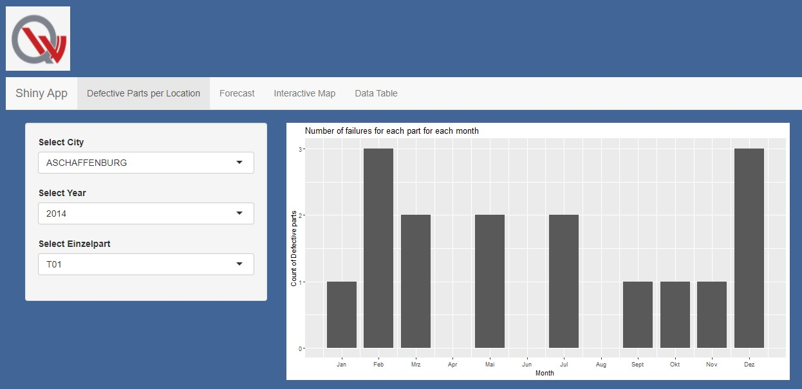
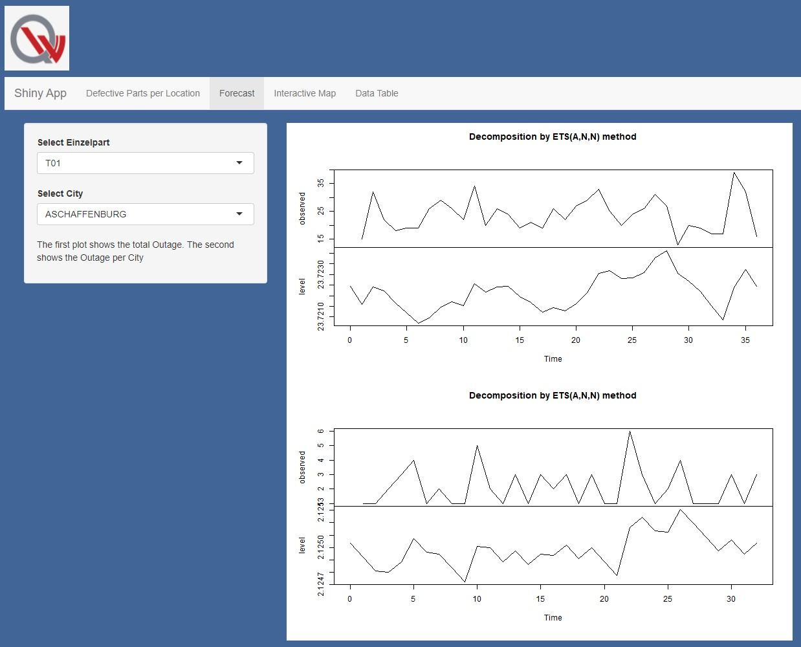

```{r setup, include=FALSE}
knitr::opts_chunk$set(echo = TRUE)
```


```{r}
# setting cran mirror
local({r <- getOption("repos")
  r["CRAN"] <- "http://cran.r-project.org" 
  options(repos=r)
})
```


## Install packages
```{r, warning = FALSE, results="hide", message=FALSE}
if (!require("readr")) install.packages("readr")       # Package needed to Import csv and txt files
if (!require("dplyr")) install.packages("dplyr")       # Package needed to arrange filter etc 
if (!require("tidyr")) install.packages("tidyr")
if (!require("comprehenr")) install.packages('comprehenr')
if (!require("lubridate")) install.packages("lubridate")   # Package needed to handle Dates
if (!require("stringr")) install.packages("stringr")

if (!require("ggplot2")) install.packages("ggplot2")
if (!require("plotly")) install.packages("plotly")
if (!require("shiny")) install.packages("shiny")       # Package for shiny application
if (!require("highcharter")) install.packages("highcharter") # Package to plot in Shiny App
if (!require("datasets")) install.packages("datasets")    
if (!require("forecast")) install.packages("forecast")    # Package to model prediction
if (!require("leaflet")) install.packages("leaflet")
if (!require("DT")) install.packages('DT')
if (!require("jpeg")) install.packages('jpeg')
```

## Import libraries
```{r, warning = FALSE, results="hide", message=FALSE}
library(ggplot2)
library(dplyr)
library(comprehenr)
library(tidyr)
library(stringr)
library(plotly)
library(readr)
library(lubridate)
library(shiny)
library(highcharter)
library(datasets)
library(forecast)
```


## 1. Data preparation

### 1.1 Data Import
The files we are importing are every file in the Data/Einzelteil folder, the files "Bestandteile_Komponente...", the files "Bestandteile_Fahrzeuge_OEM...", the file "Zulassungen_alle_Fahrzeuge.csv" containing the approvals and the file "Geodaten_Gemeinden_v1.2_2017-08-22_TrR.csv" containing the location of the cities we are curious about.

#### 1.1.1 Import the individual parts
This function enables us to import .txt files by providing the following needed arguments
- partname : the name of the part as a String (e.g. "T01", "T02", ..., "27", "T30", ..., "T40")
- eol_split_str : the string that splits the entries
- col_split_str : the string that splits the features of an entry

There is also the option to replace parts of the read file and simplify the process of seperating by an EOL/Column separation string. If this feature is used, both of the following optional arguments have to be a String:
- pattern_to_replace : the pattern to replace
- replacement : the string to replace the pattern_to_replace

```{r}
import_txt_part_df <- function(partname="T01", eol_split_str, col_split_str, pattern_to_replace=NULL, replacement=NULL){
    filename <- paste("Data/Einzelteil/Einzelteil_", partname, ".txt", sep="")
    part_as_string <- readLines(filename)
    
    if (!is.null(pattern_to_replace)){
        # this is optional and can help establish a better string to seperate columns or entries
        part_as_string <- gsub(pattern = pattern_to_replace, replace = replacement, x = part_as_string)
    }
    
    # cleaning the data by removing all the double quotes which would appear in the dataframe if we didnt remove them
    part_as_string <- gsub(pattern = '\"', replace = '', x = part_as_string)
    
    # these two lines convert the string to a list of lists where one sublist contains values of one entry (except the first sublist which contains the header)
    part_rows_as_string <- strsplit(part_as_string, split=eol_split_str)
    part_rows <- sapply(part_rows_as_string, strsplit, split=col_split_str)
    
    part_df <- data.frame(do.call(rbind, part_rows[2:length(part_rows)]))
    
    # take the first row read and use it as the header of the df
    # since in every df there is one columnname missing we added a "Placeholder" columnname for the 1. column 
    row.names(part_df) <- NULL
    names(part_df) <- c("Placeholder", part_rows[[1]])
    
    rm(part_as_string, part_rows_as_string, part_rows)
    return(part_df)
}
```

This function takes the argument
- __partname__ : the name of the part as a String (e.g. "T01", "T02", ..., "27", "T30", ..., "T40")
and imports the corresponding data as a dataframe.

For the bigger .csv files as well as the .txt files we have a seperate if case to import them faster. The smaller .csv files can be imported either by the __read_csv__ or the __read_csv2__ function.
```{r}
import_part_df <- function(partname="T01"){
    if (partname == "T01"){
        return(import_txt_part_df(partname, 
                                  eol_split_str = " ", 
                                  col_split_str = ";", 
                                  pattern_to_replace = " \\| \\| ", 
                                  replacement = ";"))
    }
  
    if (partname == "T02"){
        return(import_txt_part_df(partname, 
                                  eol_split_str = "\t", 
                                  col_split_str = "  "))                
    }
  
    if (partname == "T03"){
        return(import_txt_part_df(partname, 
                                  eol_split_str = "\v", 
                                  col_split_str = "\\|"))  
    }
  
    if (partname == "T05"){
        return(read_csv("Data/Einzelteil/Einzelteil_T05.csv"))
    }

    if (partname == "T07"){
        return(import_txt_part_df(partname, 
                                  eol_split_str = ";", 
                                  col_split_str = "\\s", 
                                  pattern_to_replace = '""', 
                                  replacement = '";"'))
    }

    if (partname == "T09"){
        return(import_txt_part_df(partname, 
                                  eol_split_str = "\v", 
                                  col_split_str = "\\\\"))
    }

    if (partname == "T11"){
        return(import_txt_part_df(partname, 
                                  eol_split_str = "\f", 
                                  col_split_str = "\\s"))
    }
  
    if (partname == "T12"){
        return(read_csv2("Data/Einzelteil/Einzelteil_T12.csv"))
    }

    if (partname == "T16"){
        return(import_txt_part_df(partname, 
                                  eol_split_str = "\t", 
                                  col_split_str = " \\| \\| "))
    }

    if (partname == "T20"){
      return(import_txt_part_df(partname, 
                                  eol_split_str = " ", 
                                  col_split_str = ";", 
                                  pattern_to_replace = " \\| \\| ", 
                                  replacement = ';'))
    }
      
    if (partname == "T21"){
        return(read_csv2("Data/Einzelteil/Einzelteil_T21.csv"))
    }
    
    if (partname == "T22"){
        return(import_txt_part_df(partname, 
                                  eol_split_str = ";", 
                                  col_split_str = "\t", 
                                  pattern_to_replace = "([^\t])\"(\\d+)\"", 
                                  replacement = "\\1;\\2"))
    }
  
    if (partname == "T23"){
        return(read_csv2("Data/Einzelteil/Einzelteil_T23.csv"))
    }

    if (partname == "T24"){
        return(import_txt_part_df(partname, 
                                  eol_split_str = "\f", 
                                  col_split_str = "  "))
    }

    if (partname == "T27"){
        return(import_txt_part_df(partname, 
                                  eol_split_str = "\a", 
                                  col_split_str = " \\| \\| "))
    }
    
    if (partname == "T30"){
        return(read_csv("Data/Einzelteil/Einzelteil_T30.csv"))
    }
    
    if (partname == "T31"){
        return(import_txt_part_df(partname, 
                                  eol_split_str = "\b", 
                                  col_split_str = "  "))
    }
  
    if (partname == "T32"){
        return(read_csv2("Data/Einzelteil/Einzelteil_T32.csv"))
    }

    if (partname == "T34"){
        return(import_txt_part_df(partname, 
                                  eol_split_str = ";", 
                                  col_split_str = " \\| \\| ", 
                                  pattern_to_replace = "\"\"(\\d+)\"", 
                                  replacement = "\";\\1"))
    }
    if (partname == "T35"){
        return(import_txt_part_df(partname, 
                                  eol_split_str = ";", 
                                  col_split_str = "\\\\", 
                                  pattern_to_replace = "([^\\])\"(\\d+)\"", 
                                  replacement = "\\1;\\2"))
    }
    if (partname == "T36"){
        return(import_txt_part_df(partname, 
                                  eol_split_str = " ", 
                                  col_split_str = ",", 
                                  pattern_to_replace = "  ", 
                                  replacement = ","))
    }

    if (partname == "T39"){
        return(import_txt_part_df(partname, 
                                  eol_split_str = "\a", 
                                  col_split_str = "\\\\"))
    }
  
    # else the part is in a csv file
    filename <- paste("Data/Einzelteil/Einzelteil_", partname, ".csv", sep="")
    part_df <- read_csv(filename)
    
    # if the seperator is not a colon, its seperator is a semicolon
    if (ncol(part_df)==1){
        part_df <- read_csv2(filename)
    }
    return(part_df)
}
```

#### 1.1.2 Import Bestandteile der Komponente Tables
Each value of an entry is seperated by semicolons, therefore we use the __read_csv2__ function. Since there ID names of the parts T01, T02, ..., T09 are designated with ID_T1, ID_T2, ... ID_T9 we use a __gsub__ function to add a "0" to the ID columnnames with a single digit.
```{r}
import_comp_parts_df <- function(compname){
    filename <- paste("Data/Komponente/Bestandteile_Komponente_", compname, ".csv", sep="")
    df <- read_csv2(filename)
    names(df) <- gsub("ID_T(\\d)$", "ID_T0\\1", names(df))
    return(df)
}
```


#### 1.1.3 Import Bestandteile der Fahrzeuge Tables
Importing all the Bestandteile_Fahrzeuge_OEM... tables as one (all 4 in 1 df) since they all have the same column names. To save more time we save this dataframe in a .rds file because we will use this dataframe often.
```{r}
import_oem_comps_df <- function(){
    #initialize empty list of size 4
    oem_df_list <- vector("list", 4)
    
    # get dataframe for each components_of_oem csv and append it to list
    idx <- 1
    for (name in c("OEM1_Typ11", "OEM1_Typ12", "OEM2_Typ21", "OEM2_Typ22")){
        filename <- paste("Data/Fahrzeug/Bestandteile_Fahrzeuge_", name, ".csv", sep="")
        oem_df <- read_csv(filename)
        if (ncol(oem_df) == 1){ # asks if the column was not seperated by simple commas
            oem_df <- read_csv2(filename) # in that case the entries are seperated by semicolons
        }
        oem_df_list[[idx]] <- oem_df
        idx <- idx + 1
    }
    
    # concatenate all of the dataframes
    df <- do.call(rbind, oem_df_list)
    
    saveRDS(df, file="Additional_Files_Group_03/oem_comps_df.rds")
    
    rm(oem_df_list)
    
}
import_oem_comps_df()
```

#### 1.1.4 Importing Approvals
```{r}
import_approvals_df <- function(){
    df <- read_csv2("Data/Zulassungen/Zulassungen_alle_Fahrzeuge.csv")
    return(df)
}
```

#### 1.1.5 Importing Geodata
```{r}
# Import Data from file Geodaten
import_geo_df <- function(){
    return(read_csv2("data/Geodaten/Geodaten_Gemeinden_v1.2_2017-08-22_TrR.csv"))
}
```


### 1.2 Helper functions

#### 1.2.1 Checks correct format of one column in a dataframe containing IDs

```{r}
is_correct_format <- function(df, columnname, filename=NA){
    temp_df <- df %>% separate(columnname, c("name", "Herstellernummer_extr", "Werksnummer_extr", NA), sep="-",  remove=FALSE)
    temp_df <- temp_df %>% filter(substr(Werksnummer_extr, 1, nchar(Werksnummer_extr)-1) != Herstellernummer_extr)
    if (nrow(temp_df) == 0){
        return(TRUE)
    }
    print(unique(temp_df$name)) # printing out the first part of the ID which should only be the name of the part/component/vehicle
    print(temp_df)
    if (!is.na(filename)){
        saveRDS(temp_df, filename)    
    }
    rm(temp_df)
    return(FALSE)
}
```

#### 1.2.2  Create List containing the names of individual parts as Strings 

```{r}
create_list_of_singlepart_names <- function(){
    # creates the partnames like T1, T2, ..., T27, T30, T31, ..., T40 as strings
    single_dig_partnames <- to_vec(for (num in 1:9) paste("T0", as.character(num), sep=""))
    double_dig_partnames <- to_vec(for (num in 10:40) if (num != 28 && num != 29) paste("T", as.character(num), sep=""))
    partnames <- c(single_dig_partnames, double_dig_partnames)
    return(partnames)
}
```

#### 1.2.3 Dictionary matching part to components

A dictionary(key-value datastructure) matching an individual part(key) to a list containing all the components that contain the individual part. 
- Keys: name(string) of an individual part 
- Value: list of components containing that individual part
- Purpose: To find out which components table to join with the individual part 
- Advantage: Joining only tables needed keeps data on RAM as low as possible
```{r, warning = FALSE, results="hide", message=FALSE}
create_component_part_dict <- function() {
    
    # this part here creates a list of empty lists 
    # a datastructure similar to a dictionary
    partnames <- create_list_of_singlepart_names()
    comp_part_dict <- list()
    for (name in partnames){
        comp_part_dict[[name]] <- list()
    }

    components <- c("K1BE1", "K1BE2", "K1DI1", "K1DI2", "K2LE1", "K2LE2", 
              "K2ST1", "K2ST2", "K3AG1", "K3AG2", "K3SG1", "K3SG2", 
              "K4", "K5", "K6", "K7")
    
    for (comp in components){
        filename <- paste("Data/Komponente/Bestandteile_Komponente_", comp, ".csv", sep="")
        df <- read_csv2(filename)
        df <- df %>% select(starts_with("ID_"))
        
        # for all parts in this comp: add to the dict, that these parts appear in this comp
        for (name in colnames(df)){
          
            # just get the name of the part (by removing the "T_" from the string)
            name <- str_replace(name, "ID_", "")
            if (nchar(name) == 2 && substr(name, 1, 1) == "T"){ # add 0 to the partname if the part has a single digit
                name <- paste("T0", substring(name, 2), sep="")
            }
            if (name == comp) 
                next
            comp_part_dict[[name]] <- c(comp_part_dict[[name]], comp)
        }
    }
    return(comp_part_dict)
}

comp_part_dict <- create_component_part_dict()
# Save the object to a file
saveRDS(comp_part_dict, file = "Additional_Files_Group_03/comp_part_dict.rds")
# Restore the object using readRDS(file = "Additional_Files_Group_03/comp_part_dict.rds")
```


### 1.3 Data Cleaning

#### 1.3.1 Cleaning Individual Part

We skimmed through each of the part's headers and found that there are might be 3 different variations of columns containing the data of the parts. One has __.x__ ending, one has a __.y__ ending and the other one has a clean name without any __.__ ending. If multiple variations exist in one table, we found out, that there in entry only of the variations is filled with non-NA values. Therefore we can seperate the variations and tidy them up by merging them together and removing the __.x__ or __.y__ ending. We further clean the table by removing the NA values in the ID columns and by adjusting the data type (the Fehlerhaft_Datum column should be of Date type) and filtering for only the entries between 2014 and 2016.
```{r}
# Filter by Error Date
# Fehlerhaft_Datum should be of Date data type
get_cleaned_part_df <- function(partname){
    part_df <- import_part_df(partname)

    # counts how many columnnames start with "ID_T"
    list_of_dfs <- vector("list", sum(grepl("^ID_T", colnames(part_df)), na.rm=TRUE))
    i <- 1
    
    
    if (paste("ID_", partname, ".x", sep="") %in% colnames(part_df)){
        temp_part_df <- part_df %>% select(starts_with("ID_T") & ends_with(".x"), Fehlerhaft_Datum.x, Herstellernummer.x, Werksnummer.x)
        temp_part_df <- temp_part_df[!is.na(temp_part_df[,1]), ]
        temp_part_df$Fehlerhaft_Datum.x <- as.Date(temp_part_df$Fehlerhaft_Datum.x, "%Y-%m-%d")
        names(temp_part_df) <- gsub(".x", "", names(temp_part_df))
        list_of_dfs[[i]] <- temp_part_df
        i <- i + 1
    }
    
    if (paste("ID_", partname, ".y", sep="") %in% colnames(part_df)){
        temp_part_df <- part_df %>% select(starts_with("ID_T") & ends_with(".y"), Fehlerhaft_Datum.y, Herstellernummer.y, Werksnummer.y)
        temp_part_df <- temp_part_df[!is.na(temp_part_df[,1]), ]
        temp_part_df$Fehlerhaft_Datum.y <- as.Date(temp_part_df$Fehlerhaft_Datum.y, "%Y-%m-%d")
        names(temp_part_df) <- gsub(".y", "", names(temp_part_df))
        list_of_dfs[[i]] <- temp_part_df
        i <- i + 1
    }
    
    if (paste("ID_", partname, sep="") %in% colnames(part_df)){
        
        temp_part_df <- part_df %>% select(starts_with("ID_") & ends_with(partname), Fehlerhaft_Datum, Herstellernummer, Werksnummer)
        temp_part_df <- temp_part_df[!is.na(temp_part_df[,1]), ]
        temp_part_df$Fehlerhaft_Datum <- as.Date(temp_part_df$Fehlerhaft_Datum, "%Y-%m-%d")
        list_of_dfs[[i]] <- temp_part_df
    }
    part_df <- do.call(rbind, list_of_dfs)
    
    #filter to error between 2014 and 2016
    error_part_df <- part_df %>% 
                  filter(Fehlerhaft_Datum >= as.Date("2014-01-01") & Fehlerhaft_Datum <= as.Date("2016-12-31")) 
    
    error_part_df <- error_part_df %>% select(contains("ID_"), Fehlerhaft_Datum)
    rm(part_df)
    return(error_part_df)
}  

```

Here we check for the correct format of the part designation. Running this, we found out that the only errors in the IDs occur for part T05 and T13.
```{r, warning = FALSE, message=FALSE}
checking_part_designation <- function(partname){
    part_df <- get_cleaned_part_df(partname)
    if (!is_correct_format(part_df, paste("ID_", partname, sep=""))){
        print("Error in ID")
        print(part_df)
    }
}

partnames <- create_list_of_singlepart_names()
for (par in partnames){
    checking_part_designation(par)
}
```

We will not correct them as for this task, we do not need any specific IDs in the final Dataset. All we need the IDs for, is to later join the tables. We will show that the errors are also in the other tables and there is a match between the erroneous data which is why we do not need to correct them.
```{r, warning = FALSE, message=FALSE}
t05_df <- get_cleaned_part_df("T05")
is_correct_format(t05_df, "ID_T05", "Additional_Files_Group_03/error_t05.rds")

t13_df <- get_cleaned_part_df("T13")
is_correct_format(t13_df, "ID_T13", "Additional_Files_Group_03/error_t13.rds")
```


#### 1.3.2 Cleaning Bestandteile Komponente Table

By running this and checking the format for every column we found out that the only errors in the ID designation are in the __ID_T5__ and the __ID_K1DI1__ columns of the component K1DI1 as well as the __ID_T13__ in the component K2ST1. 
```{r, warning = FALSE, message=FALSE}
checking_part_designation_in_comp_parts <- function(compname="K1DI1"){
    comp_parts_df <- import_comp_parts_df(compname)
    comp_parts_df <- comp_parts_df %>% select(starts_with("ID_"))
    
    for (col in colnames(comp_parts_df)){
        if (!is_correct_format(comp_parts_df, col)){
            print(paste(">>>", col))
        }
    }
}

components <- c("K1BE1", "K1BE2", "K1DI1", "K1DI2", "K2LE1", "K2LE2", 
              "K2ST1", "K2ST2", "K3AG1", "K3AG2", "K3SG1", "K3SG2", 
              "K4", "K5", "K6", "K7")
for (com in components){
    checking_part_designation_in_comp_parts(com)
}
```


```{r, message=FALSE, warning=FALSE}
k1di1_df <- import_comp_parts_df("K1DI1")
is_correct_format(k1di1_df, "ID_T05", "Additional_Files_Group_03/error_t05_in_k1di1.rds")
error_t05_in_k1di1 <- readRDS("Additional_Files_Group_03/error_t05_in_k1di1.rds")
error_t05 <- readRDS("Additional_Files_Group_03/error_t05.rds")
all(error_t05$ID_T05 %in% error_t05_in_k1di1$ID_T05) 
```

```{r, message=FALSE, warning=FALSE}
is_correct_format(k1di1_df, "ID_K1DI1", "Additional_Files_Group_03/error_k1di1.rds")
```


```{r, message=FALSE, warning=FALSE}
k2st1_df <- import_comp_parts_df("K2ST1")
is_correct_format(k2st1_df, "ID_T13", "Additional_Files_Group_03/error_t13_in_k2st1.rds")

error_t13_in_k2st1 <- readRDS("Additional_Files_Group_03/error_t13_in_k2st1.rds")
error_t13 <- readRDS("Additional_Files_Group_03/error_t13.rds")
all(error_t13$ID_T13 %in% error_t13_in_k2st1$ID_T13)
```


Since we will later join these tables on the Bestandteile_Fahrzeuge_OEM... tables which have another column name, we will now rename the column in the Bestandteile Komponente tables.

Step 1: Find out what kind of component(engine, chair, bodywork, gear shift) a particular component is. Here we create a named list that matches the name of the component to its ID name. So if the component is a chair, the ID name is "ID_Sitze". If the component is the engine, then the ID name is "ID_Motor". If the component is the body work its ID name is ID_Karosserie and if the component is a gear shift, then its ID name is "ID_Schaltung". This will be useful for the Merging later on because the Table containing the components of the vehicles uses these component ID names(ID_Motor, ID_Sitze, ID_Schaltung, ID_Karosserie) as its column names.
```{r}
# This list matches all of the components to their corresponding ID Name.
# This will be useful when we join Bestandteile_Komponente_ Tables and 
# Bestandteile_Fahrzeuge_OEM tables (on the ID of the Component)
comp_id_name <- list(K1BE1 = "ID_Motor",
                     K1BE2 = "ID_Motor",
                     K1DI1 = "ID_Motor",
                     K1DI2 = "ID_Motor",
                     K2LE1 = "ID_Sitze",
                     K2LE2 = "ID_Sitze",
                     K2ST1 = "ID_Sitze",
                     K2ST2 = "ID_Sitze",
                     K3AG1 = "ID_Schaltung",
                     K3AG2 = "ID_Schaltung",
                     K3SG1 = "ID_Schaltung",
                     K3SG2 = "ID_Schaltung",
                     K4 = "ID_Karosserie",
                     K5 = "ID_Karosserie",
                     K6 = "ID_Karosserie",
                     K7 = "ID_Karosserie")

```
Step 2: We save this data structure in a .rds file called "comp_id_name.rds" under the __Additional_Files_Group_03__ folder. Additionally we wrote a function to use this list later on.
```{r, warning = FALSE, results="hide", message=FALSE}
# We use this line of code to save the named list in a .rds file for later reuse.
saveRDS(comp_id_name, file = "Additional_Files_Group_03/comp_id_name.rds")
# Restore the object using this line.
# ciname <- readRDS(file = "Additional_Files_Group_03/comp_id_name.rds")
```
```{r}
# input: comp (String), e.g. "K1DI1" or "K3SG2"
get_comp_id_name <- function(comp){
    comp_id_name <- readRDS(file = "Additional_Files_Group_03/comp_id_name.rds")
    return(comp_id_name[[comp]])
}
```
Step 3: We select only the columns we need which are just the columns containing the ID of the component and the column containing the ID of the part. We then rename the column containing the component ID to its corresponding ID name (See step 1).
```{r}
get_cleaned_comp_parts_df <- function(partname, compname){
    comp_parts_df <- import_comp_parts_df(compname)
    if (substr(partname, 2, 2) == "0"){
        names(comp_parts_df)[names(comp_parts_df) == paste("ID_T", substr(partname, 3, 3), sep="")] <- paste("ID_", partname, sep = "")
    }
    cleaned_df <- comp_parts_df %>% select(paste("ID_", partname, sep=""), paste("ID_", compname, sep=""))
    
    rm(comp_parts_df)
    
    # rename id_comp to specific id name in order to later join the df to the OEM df
    # for example: ID_K1BE1 -> ID_Motor, ID_K7 -> ID_Karosserie
    comp_id_name <- get_comp_id_name(compname)
    names(cleaned_df)[names(cleaned_df) == paste("ID_", compname, sep="")] <- comp_id_name
    
    return(cleaned_df)
}
```

#### 1.3.3 Cleaning Bestandteile_Fahrzeuge

Checking the ID columns, we find again that there are errors in the ID_Motor column, specifically only for the K1DI1 component. 
```{r, message=FALSE, warning=FALSE}
oem_comps_df <- readRDS("Additional_Files_Group_03/oem_comps_df.rds")
for (col in colnames((oem_comps_df))){
    is_correct_format(oem_comps_df, col)    
}
```

Here we check whether the errors in K1DI1 from before can be found in the errors in the engine column. That is the case which is why we don't have to fix the IDs.
```{r}
is_correct_format(oem_comps_df, "ID_Motor", "Additional_Files_Group_03/error_motor.rds")

error_motor <- readRDS("Additional_Files_Group_03/error_motor.rds")
error_k1di1 <- readRDS("Additional_Files_Group_03/error_k1di1.rds")
all(error_k1di1$ID_K1DI1 %in% error_motor$ID_Motor) 
```


```{r}
get_cleaned_oem_comps_df <- function(){
    df <- readRDS("Additional_Files_Group_03/oem_comps_df.rds")
    return(df)
}
```


#### 1.3.4 Cleaning Approvals

There are some IDs in the approvals that are not in a correct format. We don't have clean this up as the Gemeinden of the erroneous rows do not contain any of the cities we are looking for.
```{r, warning = FALSE, message=FALSE, results='hide'}
approv_df <- import_approvals_df()
```


```{r, warning = FALSE, message=FALSE}
is_correct_format(approv_df, "IDNummer")
```

Here we check for duplicates in the IDNummer column by comparing the number of rows to the number of unique IDs. Seeing how the numbers are different, there are duplicates we later have to remove. 
```{r}
nrow(approv_df)
length(unique(approv_df$IDNummer ))
```

But there might still be misspellings in the names of the Gemeinde of the provided entries (e.g. "BUCHA" and "BUCHA1"). To find errors we use the __adist__ function to measure the generalized Levenshtein (edit) distance. Here we allow a maximum distance of 2.
```{r}
checking_for_misspellings_in_approvals <- function(){
    approvals_df <- import_approvals_df()
    
    text <- unique(approvals_df$Gemeinden)
    
    # filter the words which have levensthein distance of maximum of 2
    words <- text[which(adist(text)<=2 & upper.tri(adist(text)), arr.ind=T)]
    
    matches_df <- as.data.frame(matrix(words,ncol=2))
    names(matches_df) <- c("First", "Second")
    
    cities <- c("AUGSBURG", "INGOLSTADT","REGENSBURG", "WUERZBURG", "BAMBERG", "BAYREUTH", "ASCHAFFENBURG", "ERLANGEN", "ROSENHEIM", "LANDSHUT")
    
    potential_missppellings <- matches_df %>% 
                    filter(First %in% cities | Second %in% cities)
    
    return(potential_missppellings)
}
```
After printing out the potential misspellings, we look up for all of the matches if the Gemeinden do exist or if a match is indeed a misspelling. 
```{r, warning = FALSE, message=FALSE}
missp <- checking_for_misspellings_in_approvals()
missp
```
We found no misspellings and therefore don't need to clean up misspellings.

This function provides us with a dataframe containing only the IDs of vehicles approved in one of the ten cities (from the task) as well as the specific city they were approved in.
```{r}
get_cleaned_approvals_df <- function(){
    df <- import_approvals_df()
    df <- unique(df)
    city <- c("AUGSBURG", "INGOLSTADT","REGENSBURG", "WUERZBURG", "BAMBERG", "BAYREUTH", "ASCHAFFENBURG", "ERLANGEN", "ROSENHEIM", "LANDSHUT")
    df <- df %>% 
            filter(Gemeinden == city) %>%
            select(-Zulassung) # remove approval date
    
    return(df)
}
```

#### 1.3.5 Cleaning geodata

Here we check for duplicates in the Gemeinde column by comparing the number of rows to the number of unique Gemeinden. If there would've been any, we would have to find out which row has the real geolocation. Fortunately that wasn't the case. 
```{r, warning = FALSE, message=FALSE}
geodf <- import_geo_df()
nrow(geodf)
length(unique(geodf$Gemeinde))
```

But there might still be misspellings in the names of the Gemeinde of the provided entries (e.g. "BUCHA" and "BUCHA1"). Just like for the approvals we use the __adist__ function to measure the generalized Levenshtein (edit) distance and find potential misspellings. Here we allow a maximum distance of 2.
```{r}
checking_for_misspellings_in_geoloc <- function(){
    geo_df <- import_geo_df()
    text <- unique(geo_df$Gemeinde)
    
    # filter the words which have levensthein distance of maximum of 2
    words <- text[which(adist(text)<=2 & upper.tri(adist(text)), arr.ind=T)]
    
    matches_df <- as.data.frame(matrix(words,ncol=2))
    names(matches_df) <- c("First", "Second")
    
    cities <- c("AUGSBURG", "INGOLSTADT","REGENSBURG", "WUERZBURG", "BAMBERG", "BAYREUTH", "ASCHAFFENBURG", "ERLANGEN", "ROSENHEIM", "LANDSHUT")
    
    potential_missppellings <- matches_df %>% 
                    filter(First %in% cities | Second %in% cities)
    
    return(potential_missppellings)
}
```

After printing out the potential misspellings, we look up for all of the matches if the Gemeinden do exist or if a match is indeed a misspelling. 
```{r, warning = FALSE, message=FALSE}
missp <- checking_for_misspellings_in_geoloc()
missp
```
We found no misspellings and therefore don't need to clean up misspellings.

This function provides us with a small dataframe containing only the latitude and longitude of the ten cities specified in the requirements. No more cleaning for this dataframe necessary.
```{r}
get_cleaned_geo_df <- function(){
    geo_df <- import_geo_df()

    cities <- c("AUGSBURG", "INGOLSTADT","REGENSBURG", "WUERZBURG", "BAMBERG", "BAYREUTH", "ASCHAFFENBURG", "ERLANGEN", "ROSENHEIM", "LANDSHUT")
geo_df <- geo_df %>%
                   filter(Gemeinde %in% cities) %>%
                   select(Stadt=Gemeinde, Laengengrad, Breitengrad)
    return(geo_df)
}
```


## 2. Merge

This function takes the argument
* partname : the name of the part as a String (e.g. "T01", "T02", ..., "27", "T30", ..., "T40")
and counts the errors of that part per city and per date (between 2014 and 2016) the error was recorded on. 

Execution steps:

1. Load the dataframe containing the erroneous part (dataframe contains the ID of the part as well as the date).

2. Find out which components contain that particular part. The names of these components will be stored in a list.

3. For each of these components we load the corresponding __Bestandteile_Komponente__ table and select only the column containing the ID of the component and the column containing the ID of the part.
    + In each loop iteration we inner join the erroneous part table and the __Bestandteile_Komponente__ table on the ID of the part. The result is a dataframe containing the component ID and the error date.
    + After that we load the combined __Bestandteile_Fahrzeuge_OEM__ table which contains the IDs for the 4 kinds of components that exist (engine, bodywork, gear, chair) and the ID of the vehicle. We inner join this table with the table we got in the previous step on the column containing the ID of the component (or its kind). From the resulting table we select only the column containing the ID of the vehicles and the error date.
    + Then we load the table containing the approvals of the vehicles and join it with the previous table on the ID of the vehicles. We get a dataframe containing the error date and the city the car was registered. 
    + We store this dataframe in a list we created outside the for loop to later aggregate the errorcount.
    
4. Now after having run the for loop: All the tables we got from the for loop will now be concatenated together using the __rbind__ function. We count the amount of errors of the part based on the unique combination of city and error date. 

We have also added a column for the month extracted from the error date and a column for the year extracted from the error date to enable easier aggregation. 
```{r}
count_error_for_part <- function(part) {
    
    part_date_df <- get_cleaned_part_df(part)

    # list of named lists where name of an element is the name of the individual part
    # and the list(element of the big list) contains the components which contain that individual part
    comp_containing_part_dict <- readRDS(file = "Additional_Files_Group_03/comp_part_dict.rds")
    
    list_of_all_comps_containing_part <- comp_containing_part_dict[[part]]
    
    # collect all dfs of the erroneous components containing the part to later sum them up
    list_of_errorcomp_dfs <- vector("list", length(list_of_all_comps_containing_part))
    idx <- 1
    
    for (comp in list_of_all_comps_containing_part){
        # one of either "ID_Motor", "ID_Karosserie", "ID_Schaltung", "ID_Sitze" depending on what kind of component comp is
        comp_id_name <- get_comp_id_name(comp)
        
        # df with following colnames: comp_id_name, "ID_"+part
        comp_parts_df <- get_cleaned_comp_parts_df(part, comp)
        
        # innerjoin with part_error_df on ID_part to find defect components and add date 
        # returns df with colnames: comp_id_name, "Datum"
        comp_date_df <-  comp_parts_df %>% 
                            inner_join(part_date_df, by=paste("ID_", part, sep="")) %>%
                            select(matches(comp_id_name), Fehlerhaft_Datum)
        
        # df with following colnames: "ID_Karosserie", "ID_Schaltung", "ID_Sitze", "ID_Motor", "ID_Fahrzeug" 
        car_comps_df <- get_cleaned_oem_comps_df()
        
        car_date_df <- car_comps_df %>% 
                            inner_join(comp_date_df, by=comp_id_name) %>%
                            select(ID_Fahrzeug, Fehlerhaft_Datum)
        
        # df with following colnames: "IDNummer", "Gemeinden", "Zulassung"
        car_city_df <- get_cleaned_approvals_df()
        
        city_date_df <- car_date_df %>% 
                            inner_join(car_city_df, by=c("ID_Fahrzeug" = "IDNummer")) %>%
                            rename(Stadt = Gemeinden) %>%
                            select(Stadt, Fehlerhaft_Datum)
        
        # group by Datum, City and then count the numbers of entries for each group
        comp_errorcount_df <- city_date_df %>% add_count(Stadt, Fehlerhaft_Datum, name="Anzahl_Fehler")
        
        list_of_errorcomp_dfs[[idx]] <- comp_errorcount_df
        
        idx <- idx + 1
        
        rm(comp_parts_df, comp_date_df, car_comps_df, car_date_df, car_city_df, city_date_df)
    }
        
    # now summarize all the dfs containing the amount of errors per component containing an erroneous part
    part_errorcount_df <- do.call(rbind, list_of_errorcomp_dfs)
    part_errorcount_df <- part_errorcount_df %>% 
                            group_by(Stadt, Fehlerhaft_Datum) %>%
                            summarise(Anzahl_Fehler = sum(Anzahl_Fehler, na.rm = TRUE))
    
    part_errorcount_df <- part_errorcount_df %>% 
                              mutate(Fehlerhaft_Jahr = as.numeric(format(Fehlerhaft_Datum, format="%Y")), Fehlerhaft_Monat = as.numeric(format(Fehlerhaft_Datum, format="%m"))) %>%
                              select(-Fehlerhaft_Datum)
   # part_errorcount_df <- add_missing_city_date_entries(part_errorcount_df)
    
    
    return(part_errorcount_df)
}
```


This function takes in the df that results from the last function containing the amount of error af a part. We fill that dataframe by adding entries where a month-year combination has no errors.
```{r}
add_missing_dates <- function(df){
    imp_cities <- c("AUGSBURG", "INGOLSTADT","REGENSBURG", "WUERZBURG", "BAMBERG", 
                    "BAYREUTH", "ASCHAFFENBURG", "ERLANGEN", "ROSENHEIM", "LANDSHUT")
    
    months_list <- 1:12
    
    year_list <- 2014:2016
    
    city_month_df <- expand_grid(imp_cities, months_list, year_list)
    
    city_month_df <- city_month_df %>%
                        as_tibble() %>%
                        setNames(c("Stadt", "Fehlerhaft_Monat", "Fehlerhaft_Jahr"))
    
    full_df <- df %>% right_join(city_month_df, by=c("Stadt", "Fehlerhaft_Jahr", "Fehlerhaft_Monat")) %>% arrange(Stadt, Fehlerhaft_Jahr, Fehlerhaft_Monat)
    full_df[is.na(full_df)] <- 0
    
    return(full_df)
}
```


In this function we create the final dataset. We use the method __create_list_of_singlepart_names__ to create a list containing the partnames as Strings and loop through this list and input each part in the __count_error_for_part__ function. We add for each of the resulting tables a column __Einzelpart__ where we input the name of the part we counted the error for so that the error are distinguishable. Each of the error dataframe for each part is saved in a seperate .rds file. We do want to concatenate them together but we decided to store them in files in order to save storage in RAM for the calculations during function executions (the same applies to every .rds file we store in Additional_Files_Group_03 folder). After having stored all of the error dataframes, we put each of them together with the __rbind__ function.  

Finally we added the latitude as well as the longitude to each of the rows depending on the city the error was recorded.  
```{r, warning=FALSE, message=FALSE, results=FALSE}
create_final_dataset <- function(){
    partnames <- create_list_of_singlepart_names()

    for (part in partnames){
        # dataframe containing the amount of errors of the part grouped by date and city
        count_df <- count_error_for_part(part)
        count_df <- add_missing_dates(count_df)
        count_df$Einzelpart = part
        
        saveRDS(count_df, file = paste("Additional_Files_Group_03/Dataset", part, ".rds", sep=""))

        rm(count_df)
    }
    
    list_of_counterrorparts_df <- vector("list", 38)
    i <- 1
    
    for (part in partnames){
        # dataframe containing the amount of errors of the part grouped by date and city
        count_df <- readRDS(paste("Additional_Files_Group_03/Dataset", part, ".rds", sep=""))
        
        list_of_counterrorparts_df[[i]] <- count_df
        i <- i + 1
        rm(count_df)
    }
    final_dataset <- do.call(rbind, list_of_counterrorparts_df)
    
    
    geo_df <- get_cleaned_geo_df()
    final_dataset <- final_dataset %>%
                        inner_join(geo_df, by="Stadt")
    
    # save final dataset
    save(final_dataset, file="Final_Data_Group_03.RData")
    
    return(final_dataset)

}

final_df <- create_final_dataset()
```


```{r, warning=FALSE, message=FALSE}
final_df
```


## 3. Shiny App: Evaluation and Results

The Shiny-App shows, examines and interprets the final data set, which was merged and cleaned from multiple data tables. The Shiny-App is divided in 4 tabs which represent the 4 tasks which are described in the Tasks. The first task is described with an "a", the second one with a "b", the third with an "c" and the last with a "d". 
The task "d" is to show the final data set which is simply an output of the data table.The documentation and way of thinking is described above.


### Task a
The first task shows an interactive bar chart stacking the numbers of Failures for each part each month. For that reason we included three filters. The first filters the location as asked in the task. The second filters the Year. In the task it said to stack the number for each month so we decided to filter by year too so that the customer can look at the number of failures each year. The third one selects the part.



The months are shown on the x axis and the number of failures is on the y axis. This Plot has no bigger meaning for the customer as it does not represent future management. It is a overview of which parts are failures in each city. For example it shows by default the number of defective parts per month for the city Aschaffenburg the year 2014 and the part T01 which equals one. That means that in Aschaffenburg in 2014 one part of T01 failed.  

### Task b
We want to forecast the amount of errors per part for the 1st quarter of 2017. We can't use the linear regression model for a time series since the linear regression model assumes that observations are indepent (an observation is only dependent on its x value). For a forecast on a time series, we use previous numbers to make a good prediction. So instead of a simple linear regression, we decided to use a widely used approach for better results: The Exponential Smoothing Forecasting model - a time series forecasting method for univariate data. Univariate data because we are looking at the development of the error count of parts over a period of time. During the evaluation of another forecast method ARIMA, we decided for the Exponential Smoothing Forecasting method since it is a simple procedure to study time series, while ARIMA is agood procedure to analysis time series. The method Artificial Neural Networks (ANN) is used for the forecast, which is configured for pattern recognition through a learning process. Both plots are 39 (36 are the available data for forecasting while the additional 3 are for the forecast) time periods long. 

For task b we built two forecast plots to predict the number of defects for the 1st quarter of 2017. The first plot shows the total Outage. The second shows the Outage per City.
On the x-axis the time periods are months starting from January 2014 (1) and until March 2017 (39). On the y-axis the observed data represents the history of the data collected, while the level index gives an estimate of the local mean of the data-generating process at this time. We use two filters, whereas the first filter indicates Einzelpart for the first plot, the second filter considers Einzelpart per city.


### Task c
Task c shows the needed parts for each city in the first quarter of 2017. It uses the data from the forecast (task b) and makes a prediction for each city. Due to a small amount of failures each month we recommend that the customer should not consider each month but order substitutes for the failed parts each quarter.


For example: We recommend buying 13 additional parts of T01 for the first quarter of 2017 for the city Augsburg. If the customer wants to know how much of another part they need they are able to filter by part and see how much additional parts are needed where.


